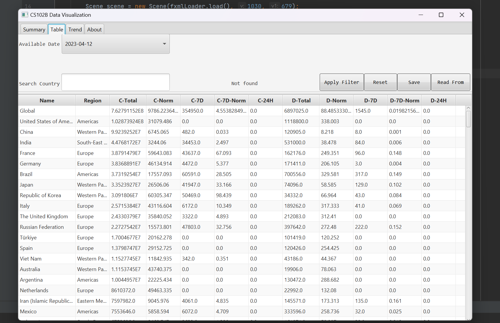
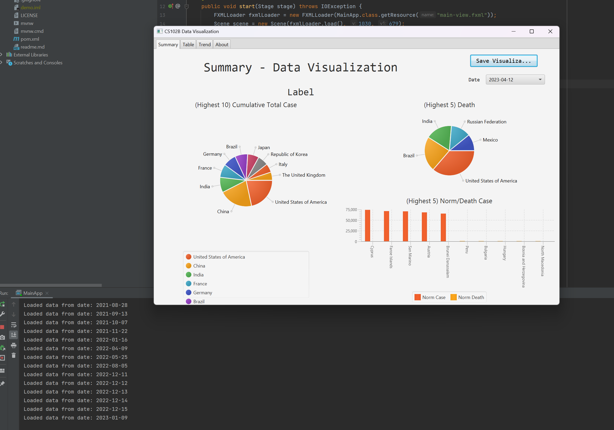

# CS102B Project Report
SUSTech Java Programming Project Sample (2022-Fall)
Contributors: [IskXCr](https://github.com/IskXCr), [XinJiayi](https://github.com/XinJiayi)
This project contains a `DataManager` and several core JavaFX pages (created by SceneBuilder).

## Satisfied Requirements

| Point | Requirement                                                  | Is satisfied | Planned |
| ----- | ------------------------------------------------------------ | ------------ | ------- |
| 10    | Read data from file                                          | Y            | Y       |
| 20    | Design suitable data structures to store data                | Y            | Y       |
| 10    | Display all data in one table-view                           | Y            | Y       |
| 20    | Use at least 2 types of charts to display various statistics. | Y            | Y       |
| 10    | Implementing the search function on table-view to display only the search results and roll back the unsearched state, or highlight the front row of search results. (Implemented, case-insensitive) | Y            | Y       |
| 10    | Implementing the sort function on table-view, such as sorted by time, country or number of people. (OK) | Y            | Y       |
| <80>  | <Sum of the basic requirements>                              |              | Y       |
| 5     | Save text type statistics to file.                           | Y            | Y       |
| 5     | Save chart or other visualization to image.                  | Y            | Y       |
| 5     | Use animation to show the growth trend of the data           |              | Y       |
| 5     | (Animation) Set the progress bar on the animation to achieve fast forward, pause and rewind. |              | Y       |
| 10    | Tracking the latest COVID-19 data automatically.             | Y            | Y       |
| 10    | Use other fancy visualization (such as map and 3D rendering etc.) to display. |              |         |
|       | <Sum of the bonus requirements>                              |              |         |

## Effects

